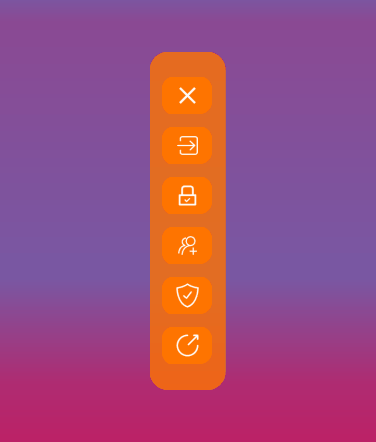
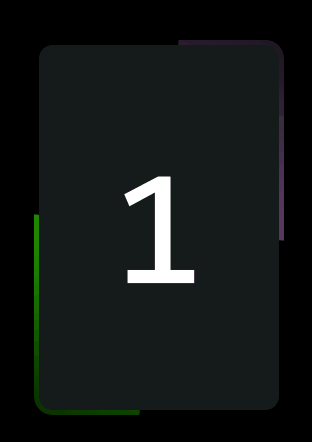

# QT-组件 QT-material-widgets
🎨 基于Qt小部件的实现😊

🎨 Qt widgets-based implementation of the Material Design specification.😊

## 内容列表
- [组件列表](#组件列表)
    - [滑动侧边栏](#滑动侧边栏)
    - [波纹按钮](#波纹按钮)
    - [流光按钮](#流光按钮)
    - [流光展示卡片](#流光展示卡片)
- [联系方式](#联系方式)

# 滑动侧边栏
## 效果

## 1.custom_btn.py
### 功能
- 按钮颜色动画
- 图标与文字分离
### 说明
1. 你可以在初始化的时候，为按钮添加文字和图标
2. 如果你需要修改，按钮样式，你需要到MyFrame.ui()中修改样式表。当然，你也可以在实例化之后，设置样式表。
   - 注意:QFrame和QPushBUtton的背景颜色要一致，同时也要修改MyFrame._color_1的颜色。
   - 当然，如果你觉得麻烦，那就别改🤣。或者写一个方法，在初始化的时候，提取样式表的颜色，然后再配置到MyFrame._color_1。
3. 在MyFrame.lableAnimation(),你可以修改动按钮的变化颜色。

## 2.main.py
### 功能
- 功能栏向两中间伸缩
- 收缩后，按钮会显示出圆角，而不是左圆右方
- 伸缩后，按钮的文字会消失
### 说明
- 在main.config_init(),可以修改变化后的伸缩栏宽度和按钮宽度，以达到更加美观的效果😌

# 波纹按钮
## 效果

## 1.悬浮波纹按钮.py(命名好像有点问题😱
### 功能
- 鼠标划入划出按钮时，出现波纹动画
- 解决了背景颜色覆盖按钮文字的问题(用一个frame做背景就可以很好解决。实在不想用painter绘制文字😭)
### 说明
1. 你可以在MyPushButton.animationConfig()配置动画参数
2. 在初始化时，你需要传入两个参数，一个是geometry(按钮的大小和位置)，一个是minSize(按钮的最小尺寸)
3. 同时，你可能还需要修改字体的大小，在MyPushButton.ui()里面
4. 此外，你甚至可以尝试把PushButton换掉，把这个样式添加到别的组件上✨

# 流光按钮
## 效果

## 1.流光按钮.py(命名好像有点问题😓
### 功能
- 鼠标悬浮时，按钮边框会出现流光
### 说明
1. **在styleSheet(样式表)，你可以通过设置Rborder-width，来配置按钮边框的宽度(流光的宽度)**
3. 在初始化之后，你需要设置按钮的geometry参数
4. 你可以在RPushButton.animationConfig()种修改定时时间，来控制流光的速度
5. RPushButton.createGradient()中，你可以修改流光的颜色🎊
6. 配置完之后，需要调用RPushButton.setStyleSheetConfig()，使配置生效❗
7. 代码中有具体的使用方法
8. 这个代码是优化过后的，可以直接调用，直接配置样式表和geometry就可以啦

## 1.流光按钮_视频演示.py(命名好像有点问题😒
### 说明
1. 这个是B站上的演示代码，并没有经过优化

# 流光展示卡片
## 效果

## 1.展示边框_优化.py
### 功能
- 看上面😂
### 说明
1. 老样子，你可以在styleSheet修改样式，之后需要调用DynamicBorderFrame.setStyleSheetConfig()使样式生效
   - Rborder-width:卡片的边框宽度
   - Rcolor:流光的颜色
   - border-radius:卡片圆角大小
2. 由于GIF帧率的问题，效果图片会出现残影

# 联系方式
- Email:2731491939@qq.com
- WeChat:Roast_71
- CsdnBlog:Rev_RoastDuck
