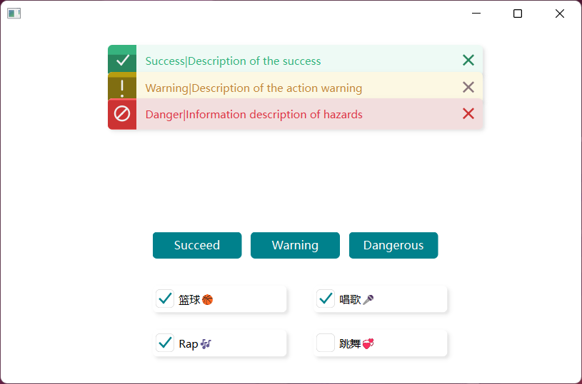
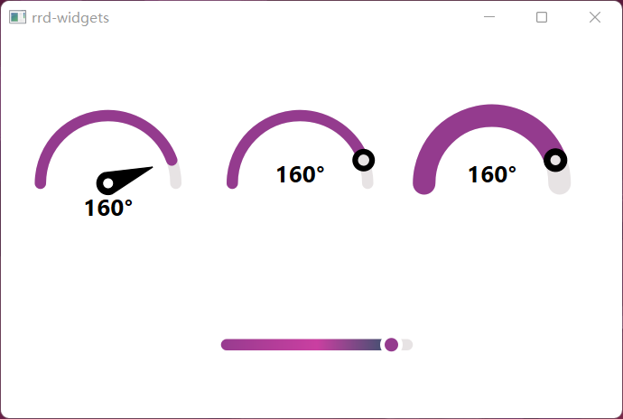
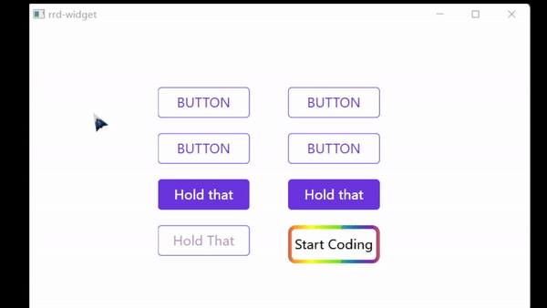
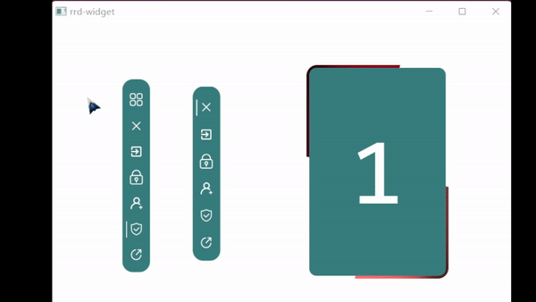

<div align="center">
  
  <h1>Qt-RoastedDuck-Widgets</h1>
  <span>😘 这是一个集成了基本 Qt 组件的库，
        <br>
        提供美观且令人赏心悦目的特效。
  </span>
</div>
<br>
<div align="center">
  
  
  
  
</div>
<p align="center">
<a href="./README_en.md">English</a> | <a href=" ">简体中文</a>
</p>

## 基本功能
- ✔ 提供14种**美化按钮**。
- ✔ 提供3种**美化输入框**。
- ✔ 提供5种**炫酷的组件容器**。
- ✔ 提供1种支持**3种状态的通知组件**。
- ✔ 提供2种**美观滑块组件**。
- ✔ 提供4种**仪表盘组件**。
- ✔ 提供美观的**复选框和下拉框（组合框）**。

## 使用示例
#### 提示和复选框


#### 仪表盘与滑块


#### 输入框组


#### 容器


#### 按钮列表


#### 滑块条


#### 幻灯片


## 快速开始
1. 将 `rrd_widget` 放置于 Python 的 `Lib` 目录下：
   ```
   cp -r ./python/rrd_widgets $(python -c "import sys; print(sys.prefix + '/Lib')")
   ```
2. 进入 `examples` 目录，在那里可以找到各种组件的示例。

## 文档
在使用 **rrd_widgets** 之前，请先阅读[帮助文档](./docs/manual-zh.md)，这里涵盖了你需要了解的一切内容！

## 许可证
Qt-RoastedDuck-Widgets 遵循 GNU 通用公共许可证第3版（GPLv3）。详细信息请参考 [LICENSE](LICENSE) 文件。

## 联系方式
- 微信: Roast_71
- 邮箱: rev-roastduck@qq.com
- CSDN博客: Rev_RoastDuck
- 哔哩哔哩: space.bilibili.com/439475163