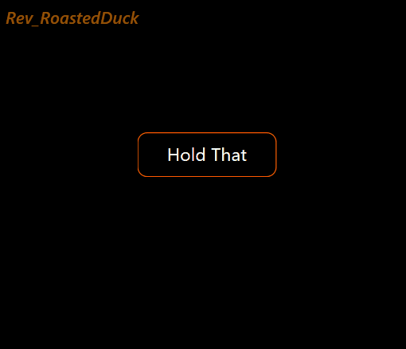

  <h1>Qt-RoastedDuck-Widgets</h1>

  
  
  
  

## 内容目录-Table of Contents
- **组件目录-Components**
  - **按钮-Button**
    - [波纹按钮-RWavyButton](#波纹按钮-RWavyButton)
    - [流光按钮-GlowButton](#流光按钮-GlowButton)
    - [简易按钮-SimpleButton](#简易按钮-SimpleButton)
    - [开关按钮-SwitchButton](#切换按钮-SwitchButton)
   
  - **输入框-LineEdit**
    - [伸缩输入框-ExpandLineEdit](#伸缩输入框-ExpandLineEdit)
    - [简易输入框-SimpleLineEdit](#简易输入框-SimpleLineEdit)
   
  - **容器-Container**
    - [发散按钮容器-RExpandButtonBox](#发散按钮容器-RExpandButtonBox)
    - [轮播图组件-SlideShowWidget](#轮播图组件-SlideShowWidget)
    - [伸缩侧边栏-FlexibleSidebar](#伸缩侧边栏-FlexibleSidebar)
    - [流光展示卡片-DynamicBorderWidget](#流光展示卡片-DynamicBorderWidget)
    - [卡片列表-CardListView](#卡片列表-CardListView)
   
  - **滑块组件-Slider**
    - [滑块-Slider](#滑块-Slider)
   
  - **通知组件-Notification Components**
    - [提示组件-TipsWidget](#提示组件-TipsWidget)
  
- [**声明-License**](#声明-License)
- [**联系-Contact**](#联系方式-Contact)

# 按钮-Button

## 波纹按钮-RWavyButton
### 效果:

### 说明:
1. 参数📃
   - font-color: 按钮的字体颜色
   - full-color: 按钮的填充颜色
   - border_radius：按钮的圆角大小
2. 方法📃
   - setParams()：配置控件的样式参数

## 流光按钮-GlowButton
### 效果:

### 说明:
1. 参数📃
   - font_color：字体颜色
   - border_width：边框宽度
   - border_radius：圆角大小
   - background_color：背景颜色
2. 方法📃
   - setParams()：配置控件的样式参数

## 简易按钮-SimpleButton
### 效果:

### 说明:
1. 参数📃
   - color：字体颜色
   - text：文本内容
   - full_color：填充的颜色
   - font_anim_start_color：动画前字体的颜色
   - font_anim_finish_color：动画后字体的颜色
   - border_radius：圆角大小
2. 参数📃
   - color：字体颜色
   - border_radius：圆角大小
   - first_text：动画前，控件显示的文本
   - second_text：动画后，控件显示的文本
   - first_background_color：动画后，控件的背景颜色
   - second_background_color：动画后，控件的背景颜色
3. 方法📃
   - setParams();配置控件的样式参数
  
## 开关按钮-SwitchButton
### 效果:

### 说明:
1. 参数📃
   - indicator_color:指示器的颜色
   - background_color:组件背景颜色
   - checked_indicator_color:点击后的指示器颜色
   - checked_background_color:点击后的背景颜色
2. 方法📃
   - setParams(): 配置必要的参数
  
# 输入框-LineEdit

## 伸缩输入框-ExpandLineEdit
### 效果:

### 说明:
1. 参数📃
   - editer_height: 输入框的高度
2. 方法📃
   - RInput.setParams(): 配置必要的参数
   - RInput.setFontToEditer(): 配置输入框的字体样式
   - RInput.setTextToPlaceholder(): 配置提示框的字体样式
3. 在配置组件高度和输入框高度的时候，记得给提示框留下充足的显示空间❗

## 简易输入框-SimpleLineEdit
### 效果:

### 说明:
1. 参数📃
   - font_color：字体颜色
   - anim_start_color：动画前边框颜色
   - anim_finish_color：动画后边框颜色
   - border_radius：圆角大小
2. 方法📃
   - setParams()：配置控件的样式参数

# 容器-Container

## 发散按钮容器-RExpandButtonBox
### 效果:

### 说明:
1. 参数📃
   - RExpandBox.locatorBoxSize: 定位组件的尺寸
   - RExpandBox.expandBoxWidgetSize: 伸缩组件的尺寸
   - RExpandBox.locatorBoxWidgetWidth: 定位按钮的宽度
   - RExpandBox.animationDuration: 每个按钮的动画的时间
   - RExpandBox.locatorBoxWidgetSpacing: 定位按钮间的间隔
   - RExpandBox.expandBoxWidgetWidth: 伸缩组件内按钮的宽度
   - RExpandBox.expandBoxWidgetSpacing: 伸缩组件内按钮的间隔
2. 方法📃
   - RExpandBox.addWidget()：添加组件
   - RExpandBox.setConfig()：使配置生效
3. styleShell中按钮的圆角大小需要为按钮宽度的二分之一倍❗

## 伸缩侧边栏-FlexibleSidebar
### 效果:

## 说明:
1. 参数📃
   - min_of_range：控件的最小宽度
   - max_of_range：控件的最大宽度
   - background_color：背景颜色
   - border_radius：圆角大小
2. 方法📃
   - setParams()：配置控件的样式参数
   
## 流光展示卡片-DynamicBorderWidget
### 效果:

### 说明:
1. 参数📃
   - Rcolor_1:流光的颜色1
   - Rcolor_2:流光的颜色2
   - border-radius:卡片圆角大小
   - Rborder-width:卡片的边框宽度
   - inside-background-color:里层背景颜色
2. 方法📃
   - setParams()：配置控件的样式参数

## 轮播图组件-SlideShowWidget
### 效果:

### 说明:
1. 参数📃
   - SlideshowWidget.timer_interval: 图片展示时间
   - SlideshowWidget.animation_time: 动画过度时间
   - SlideshowWidget.lr_widget_size: 两侧图片的尺寸
   - SlideshowWidget.middel_widget_size: 中间图片的尺寸
2. 方法📃
   - `SlideshowWidget.addPixmap()`:添加待显示的图片
4. `SlideshowWidget.animation_time`和`SlideshowWidget.timer_interval`需要到`SlideshowWidget.__animationParmas()`内自行配置❗

## 卡片列表-CardListView
### 效果:

### 说明:

# 滑块组件-Slider
## 滑块-Slider
### 效果:

### 说明:
1. 参数📃
   - color_groove_sub:被handle滑动槽的颜色
   - color_groove_add:未被handle滑动槽的颜色
   - color_handle_inside:handle(圆形内部的颜色)
   - color_handle_outside:handle(圆形外部的颜色)
   - width_line:滑动槽的宽度
   - radius_handle:handle的半径大小
2. 该控件使用了不同的接口实现，分别是QPainter.drawLine()和Qpainter.drawRect()
3. 该控件的参数设置接口还未实现，但是你可以在Slider.__paramsConfig()内部修改组件参数

# 通知组件-Notification Components
## 提示组件-TipsWidget
### 效果:

### 说明:

# 声明-License
Qt-RoastedDuck-Widgets 使用GPLv3许可证.

# 联系方式-Contact
- WeChat:Roast_71
- csdnBlog:Rev_RoastDuck
- BliBli:https://space.bilibili.com/439475163
