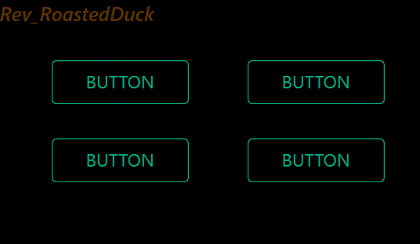
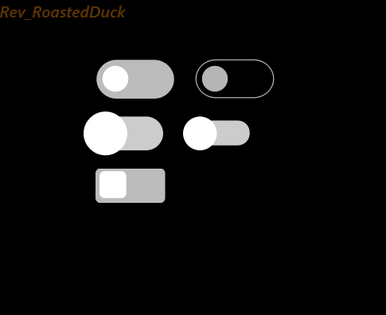
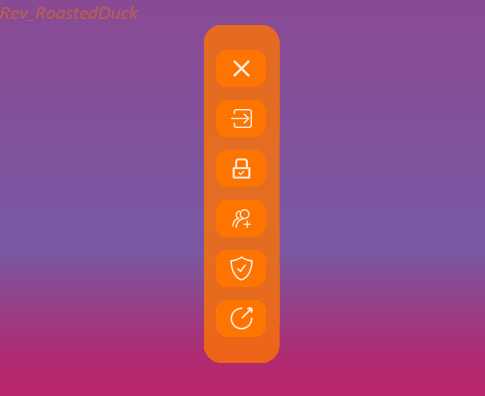
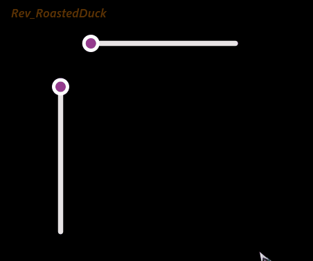

  <h1>Qt-RoastedDuck-Widgets</h1>

## 内容列表
- **组件列表**
  - **按钮|Button**
    - [波纹按钮|RWavyButton](#RWavyButton)
    - [流光按钮|GlowButton](#GlowButton)
    - [简易按钮|SimpleButton](#SimpleButton)
    - [切换开关|SwitchButton](#SwitchButton)
   
  - **输入框|LineEdit**
    - [伸缩输入框|ExpInput](#ExpandLineEdit)
    - [简易输入框|SimpleInput](#SimpleLineEdit)
   
  - **容器|Container**
    - [发散按钮容器|RExpandBox](#RExpandButtonBox)
    - [轮播图组件|SlideShowImageWidget](#SlideShowWidget)
    - [伸缩侧边栏|DynamicBorderWidget](#FlexibleSidebar)
    - [流光展示卡片|DynamicBorderWidget](#DynamicBorderWidget)
   
  - **滑块|Slider**
    - [滑块组件|Slider](##Slider)
      
- [**联系方式**](#联系方式)
- [**声明**](#声明)

# 按钮|Button

## RWavyButton
### 效果

### 说明
1. 参数说明📃
   - font-color: 按钮的字体颜色
   - full-color: 按钮的填充颜色
   - border_radius：按钮的圆角大小
2. 方法说明📃
   - setParams()：配置控件的样式参数

## GlowButton
### 效果

### 说明
1. 参数说明📃
   - font_color：字体颜色
   - border_width：边框宽度
   - border_radius：圆角大小
   - background_color：背景颜色
2. 方法说明📃
   - setParams()：配置控件的样式参数

## SimpleButton
### 效果

### 说明
1. 参数说明📃
   - color：字体颜色
   - text：文本内容
   - full_color：填充的颜色
   - font_anim_start_color：动画前字体的颜色
   - font_anim_finish_color：动画后字体的颜色
   - border_radius：圆角大小
2. 参数说明📃
   - color：字体颜色
   - border_radius：圆角大小
   - first_text：动画前，控件显示的文本
   - second_text：动画后，控件显示的文本
   - first_background_color：动画后，控件的背景颜色
   - second_background_color：动画后，控件的背景颜色
3. 方法说明📃
   - setParams();配置控件的样式参数
  
## SwitchButton
### 效果

### 说明
1. 参数说明📃
   - indicator_color:指示器的颜色
   - background_color:组件背景颜色
   - checked_indicator_color:点击后的指示器颜色
   - checked_background_color:点击后的背景颜色
2. 方法说明📃
   - setParams(): 配置必要的参数
  
# 输入框|LineEdit

## ExpandLineEdit
### 效果

### 说明
1. 参数说明📃
   - editer_height: 输入框的高度
2. 方法说明📃
   - RInput.setParams(): 配置必要的参数
   - RInput.setFontToEditer(): 配置输入框的字体样式
   - RInput.setTextToPlaceholder(): 配置提示框的字体样式
3. 在配置组件高度和输入框高度的时候，记得给提示框留下充足的显示空间❗

## SimpleLineEdit
### 效果

### 说明
1. 参数说明📃
   - font_color：字体颜色
   - anim_start_color：动画前边框颜色
   - anim_finish_color：动画后边框颜色
   - border_radius：圆角大小
2. 方法说明📃
   - setParams()：配置控件的样式参数

# 容器|Container

## RExpandButtonBox
### 效果

### 说明
1. 参数说明📃
   - RExpandBox.locatorBoxSize: 定位组件的尺寸
   - RExpandBox.expandBoxWidgetSize: 伸缩组件的尺寸
   - RExpandBox.locatorBoxWidgetWidth: 定位按钮的宽度
   - RExpandBox.animationDuration: 每个按钮的动画的时间
   - RExpandBox.locatorBoxWidgetSpacing: 定位按钮间的间隔
   - RExpandBox.expandBoxWidgetWidth: 伸缩组件内按钮的宽度
   - RExpandBox.expandBoxWidgetSpacing: 伸缩组件内按钮的间隔
2. 方法说明📃
   - RExpandBox.addWidget()：添加组件
   - RExpandBox.setConfig()：使配置生效
3. styleShell中按钮的圆角大小需要为按钮宽度的二分之一倍❗

## FlexibleSidebar
### 效果

## 说明
1. 参数说明📃
   - min_of_range：控件的最小宽度
   - max_of_range：控件的最大宽度
   - background_color：背景颜色
   - border_radius：圆角大小
2. 方法说明📃
   - setParams()：配置控件的样式参数
   
## DynamicBorderWidget
### 效果

### 说明
1. 参数说明📃
   - Rcolor_1:流光的颜色1
   - Rcolor_2:流光的颜色2
   - border-radius:卡片圆角大小
   - Rborder-width:卡片的边框宽度
   - inside-background-color:里层背景颜色
2. 方法说明📃
   - setParams()：配置控件的样式参数

## SlideShowWidget
### 效果

### 说明
1. 参数说明📃
   - SlideshowWidget.timer_interval: 图片展示时间
   - SlideshowWidget.animation_time: 动画过度时间
   - SlideshowWidget.lr_widget_size: 两侧图片的尺寸
   - SlideshowWidget.middel_widget_size: 中间图片的尺寸
2. 方法说明📃
   - `SlideshowWidget.addPixmap()`:添加待显示的图片
4. `SlideshowWidget.animation_time`和`SlideshowWidget.timer_interval`需要到`SlideshowWidget.__animationParmas()`内自行配置❗

# 滑块|Slider
## Slider
### 效果

### 说明
1. 参数说明📃
   - color_groove_sub:被handle滑动槽的颜色
   - color_groove_add:未被handle滑动槽的颜色
   - color_handle_inside:handle(圆形内部的颜色)
   - color_handle_outside:handle(圆形外部的颜色)
   - width_line:滑动槽的宽度
   - radius_handle:handle的半径大小
2. 该控件使用了不同的接口实现，分别是QPainter.drawLine()和Qpainter.drawRect()
3. 该控件的参数设置接口还未实现，但是你可以在Slider.__paramsConfig()内部修改组件参数

# 联系方式
- WeChat:Roast_71
- csdnBlog:Rev_RoastDuck
- BliBli:https://space.bilibili.com/439475163

# 许可证
Qt-RoastedDuck-Widgets 使用GPLv3许可证.
