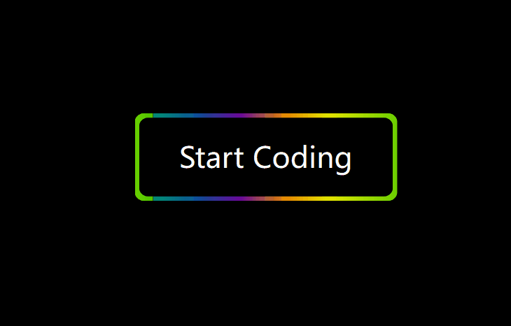
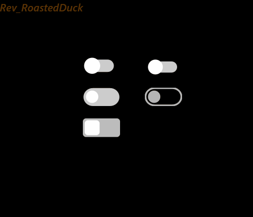
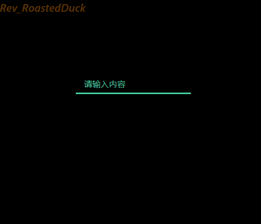
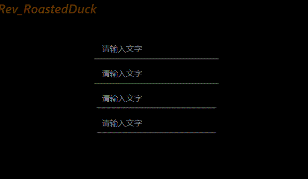
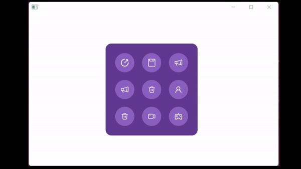
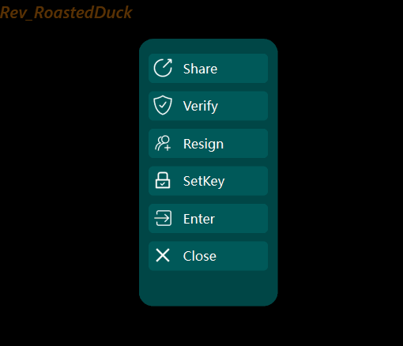
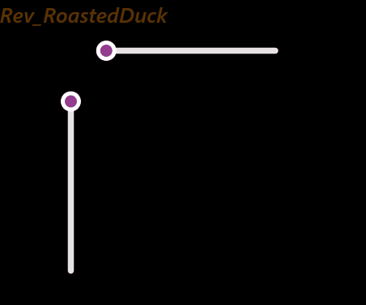
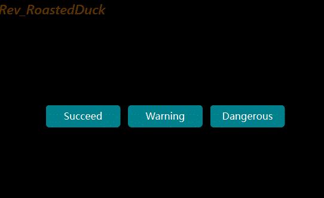
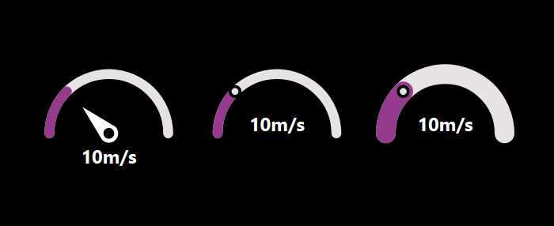

<div align="center">
  <h1>Qt-RoastedDuck-Widgets</h1>

</div>
<div align="center">
  
  
  
  
</div>


## 内容目录
- **组件目录**
  - **按钮**
    - [波纹按钮](#波纹按钮)
    - [流光按钮](#流光按钮)
    - [简易按钮](#简易按钮)
    - [微光按钮](#微光按钮)
    - [开关按钮](#切换按钮)

  
  - **输入框**
    - [伸缩输入框](#伸缩输入框)
    - [简易输入框](#简易输入框)
  
  - **组合框**
    - [组合框](#组合框)
    
  - **复选框**
    - [复选框](#复选框)

  - **容器**
    - [发散按钮容器](#发散按钮容器)
    - [轮播图组件](#轮播图组件)
    - [伸缩侧边栏](#伸缩侧边栏)
    - [流光展示卡片](#流光展示卡片)
    - [卡片列表](#卡片列表)
  
  - **滑块组件**
    - [滑块](#滑块)
  
  - **通知组件**
    - [提示弹窗](#提示弹窗)

  - **仪表组件**
    - [速度仪表](#速度仪表)
  
- [**声明**](#声明)
- [**联系**](#联系方式)


<hr/>

# 按钮

## 波纹按钮
### 效果:

### 说明:
1. 参数📃
   - font-color: 按钮的字体颜色
   - full-color: 按钮的填充颜色
   - border_radius：按钮的圆角大小
2. 方法📃
   - setParams()：配置控件的样式参数

## 流光按钮
### 效果:

### 说明:
1. 参数📃
   - font_color：字体颜色
   - border_width：边框宽度
   - border_radius：圆角大小
   - background_color：背景颜色
2. 方法📃
   - setParams()：配置控件的样式参数

## 简易按钮
### 效果:


### 说明:
1. 参数📃
   - color：字体颜色
   - text：文本内容
   - full_color：填充的颜色
   - font_anim_start_color：动画前字体的颜色
   - font_anim_finish_color：动画后字体的颜色
   - border_radius：圆角大小
2. 参数📃
   - color：字体颜色
   - border_radius：圆角大小
   - first_text：动画前，控件显示的文本
   - second_text：动画后，控件显示的文本
   - first_background_color：动画后，控件的背景颜色
   - second_background_color：动画后，控件的背景颜色
3. 方法📃
   - setParams();配置控件的样式参数

## 开关按钮
### 效果:

### 说明:
1. 参数📃
   - indicator_color:指示器的颜色
   - background_color:组件背景颜色
   - checked_indicator_color:点击后的指示器颜色
   - checked_background_color:点击后的背景颜色
2. 方法📃
   - setParams(): 配置必要的参数

## 微光按钮
### 效果:

### 说明:
1. 参数📃
   - font_color:字体颜色
   - shimmer_color_1:背景颜色1
   - shimmer_color_2:背景颜色2
   - border_radius:按钮圆角大小
   - shimmer_blur_radius:模糊程度
   - timer_interval:动画时间间隔
   

# 输入框

## 伸缩输入框
### 效果:

### 说明:
1. 参数📃
   - editer_height: 输入框的高度
2. 方法📃
   - RInput.setParams(): 配置必要的参数
   - RInput.setFontToEditer(): 配置输入框的字体样式
   - ~~RInput.setTextToPlaceholder()~~ RInput.setPlaceholderText(): 配置提示框的字体样式
3. 在配置组件高度和输入框高度的时候，记得给提示框留下充足的显示空间❗


## 简易输入框
### 效果:

### 说明:
1. 参数📃
   - font_color：字体颜色
   - anim_start_color：动画前边框颜色
   - anim_finish_color：动画后边框颜色
   - border_radius：圆角大小
2. 方法📃
   - setParams()：配置控件的样式参数


# 组合框
## 组合框
### 效果:

### 说明:
1. 参数📃
   - ComboBoxItem
     - color_font:item的字体颜色
     - color_hover:鼠标悬浮时，item的背景颜色
     - color_border:item的边框颜色
     - color_background:item的背景颜色
     - border_radius:item的圆角大小
     - item_spacing:item的间距
     - item_height:item的高度
   - ComboBoxWidget
     - border_radius:控件的圆角大小
     - background_color:控件的背景颜色
2. 方法📃
   - getCurrIndex() -> int :获取当前被选中的Item的index
   - getCurrText() -> str :获取当前被选中的Item的文本
   - itemData(index: int) -> Any :通过index获取对应的data
   - itemText(index: int) -> str :通过index获取对应的文本
   - itemIcon(index: int) -> QIcon :通过index获取对应的图标
   - addItem(icon: QIcon, text: str, data) -> None :添加Item
   - addItems(self, items: List[str]) -> None :批量添加Item
   - clear() -> None :清空Item
   - setFont() -> None :设置字体
   - setItemHeight(self, h: int) -> None :设置Item的高度
   - setItemParams(...) -> None :设置Item样式
   - setParams(...) -> None :设置组件样式
   - setCurrentIndex(index:int) -> None :设置设置默认值


# 复选框
## 复选框
### 效果:

### 说明:
1. 参数📃
2. 方法📃
   - setFont(font:QFont) -> None :设置字体
   - setText(text:str) -> None :设置文本


# 容器

## 发散按钮容器
### 效果:

### 说明:
1. 参数📃
   - RExpandBox.locatorBoxSize: 定位组件的尺寸
   - RExpandBox.expandBoxWidgetSize: 伸缩组件的尺寸
   - RExpandBox.locatorBoxWidgetWidth: 定位按钮的宽度
   - RExpandBox.animationDuration: 每个按钮的动画的时间
   - RExpandBox.locatorBoxWidgetSpacing: 定位按钮间的间隔
   - RExpandBox.expandBoxWidgetWidth: 伸缩组件内按钮的宽度
   - RExpandBox.expandBoxWidgetSpacing: 伸缩组件内按钮的间隔
2. 方法📃
   - RExpandBox.addWidget()：添加组件
   - RExpandBox.setConfig()：使配置生效
3. styleShell中按钮的圆角大小需要为按钮宽度的二分之一倍❗


## 伸缩侧边栏
### 效果:

## 说明:
1. 参数📃
   - min_of_range：控件的最小宽度
   - max_of_range：控件的最大宽度
   - background_color：背景颜色
   - border_radius：圆角大小
2. 方法📃
   - setParams()：配置控件的样式参数
   
## 流光展示卡片
### 效果:

### 说明:
1. 参数📃
   - Rcolor_1:流光的颜色1
   - Rcolor_2:流光的颜色2
   - border-radius:卡片圆角大小
   - Rborder-width:卡片的边框宽度
   - inside-background-color:里层背景颜色
2. 方法📃
   - setParams()：配置控件的样式参数


## 轮播图组件
### 效果:

### 说明:
1. 参数📃
   - SlideshowWidget.timer_interval: 图片展示时间
   - SlideshowWidget.animation_time: 动画过度时间
   - SlideshowWidget.lr_widget_size: 两侧图片的尺寸
   - SlideshowWidget.middel_widget_size: 中间图片的尺寸
2. 方法📃
   - `SlideshowWidget.addPixmap()`:添加待显示的图片
4. `SlideshowWidget.animation_time`和`SlideshowWidget.timer_interval`需要到`SlideshowWidget.__animationParmas()`内自行配置❗

## 卡片列表
### 效果:

### 说明:
1. 添加委托到ListView即可。


# 滑块组件
## 滑块
### 效果:

### 说明:
1. 参数📃
   - color_groove_sub:被handle滑动槽的颜色
   - color_groove_add:未被handle滑动槽的颜色
   - color_handle_inside:handle(圆形内部的颜色)
   - color_handle_outside:handle(圆形外部的颜色)
   - width_line:滑动槽的宽度
   - radius_handle:handle的半径大小
2. 该控件使用了不同的接口实现，分别是QPainter.drawLine()和Qpainter.drawRect()
3. ~~该控件的参数设置接口还未实现，但是你可以在Slider.__paramsConfig()内部修改组件参数~~
4. 该控件的渐变色设置的外部接口还未实现，但是你可以重写Slider.__createGradient()，以实现不一样的渐变色控件

# 通知组件
## 提示弹窗
### 效果:

### 说明:
1. 示例📃
   ```python
        tip = TipsWidget(self)                              # 实例化组件
        tip.setText("Success|Description of the success")   # 添加提示语
        tip.status = TipsStatus.Succeed                     # 设置提示状态
        tip.move(120, 20)                                   # 设置显示位置
        tip.show()                                          # 显示
   ```
2. 动画结束后，组件会自动销毁❗

# 仪表组件
## 速度仪表
### 效果:

### 说明：
1. 参数📃
   - radius:表盘大小
   - color_triangle:指针的颜色
   - color_arc_sub:圆环内已覆盖区域的颜色
   - color_arc_add:圆环内未覆盖区域的颜色
   - color_font:文字的颜色
   - text_unit:数值的单位
   - text_y:文本的位置(原点位置在组件(圆环)的中心)
   - text_height:文本的高度
2. 方法📃
   - updateValue():更新当前值
   - setRange():设置数值范围


# 声明
Qt-RoastedDuck-Widgets 使用GPLv3许可证.

# 联系方式
- WeChat:Roast_71
- csdnBlog:Rev_RoastDuck
- BliBli:https://space.bilibili.com/439475163
